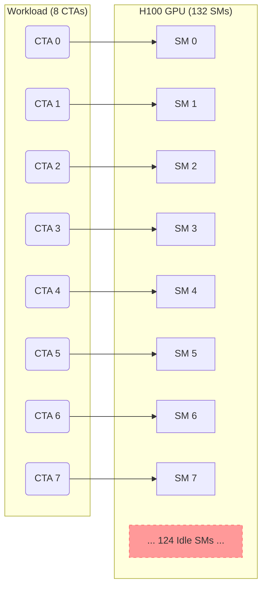

# Technical Details: Tile-Aware Split Heuristic

This document explains the technical mechanisms behind the proposed FlashAttention-3 patch, why it is necessary, and how it resolves hardware underutilization on NVIDIA Hopper GPUs.

## 1. The Bottleneck: Hardware Underutilization

On an NVIDIA H100 (Hopper), there are **132 Streaming Multiprocessors (SMs)**. To achieve peak throughput, a kernel must ideally occupy all SMs simultaneously.

### The SM Starvation Problem
In **Multi-Query Attention (MQA)** or **Grouped-Query Attention (GQA)** regimes with short context, the number of parallel work units (tiles) can be as low as 8 ($Batch \times H_{KV}$). Without sequence splitting, the baseline heuristic launches only one Thread Block (CTA) per tile, leaving most of the GPU idle.


> [!IMPORTANT]
> In the diagram above, **~94% of the GPU (124/132 SMs)** remains completely idle during the kernel execution, leading to the "starvation" bottleneck.

---

## 2. The Flaw: The Premature Guard

The root cause of this underutilization was a **premature return guard** in the FlashAttention-3 heuristic logic.

### Original C++ Code (`heuristics.h`)
The original implementation contained the following check early in the `num_splits_heuristic` function:

```cpp
// --- ORIGINAL CODE ---
if (num_n_blocks <= 4) {
    return 1;
}
```

### Why It was Flawed
This guard was originally intended as a "fast path" to avoid the overhead of sequence splitting for short sequences (where $L \le 512$). However, it suffered from two critical architectural oversights:

1.  **Ignored Head Count ($H_{KV}$)**: It only looked at the sequence length (`num_n_blocks`), completely ignoring how many KV heads were active. In Multi-Head Attention (MHA) with 64+ heads, launching 1 CTA per head is enough to fill the GPU. But in MQA ($H_{KV}=1$), it only launches **one CTA per batch item**, which is insufficient.
2.  **Ignored SM Scale**: It did not account for the massive SM count of the H100 (132 SMs). A shortcut that was "safe" on older, smaller GPUs became a major bottleneck on modern Hopper silicon.

By returning `1` split unconditionally, it prevented the sophisticated efficiency optimizer (the "efficiency loop") from ever seeing these low-tile cases.

---

## 3. The Solution: Tile-Aware Heuristic Fix

The solution is to force **Sequence Splitting** when the number of tiles is low, even for relatively short sequences ($L \approx 512$). This divides the KV-cache sequence among multiple SMs, increasing the total CTA count to fill the GPU.

### The Code Change (High-Level)

The fix replaces a premature exit guard in the heuristic logic with a "tile-aware" check.

#### C++ Logic (Proposed Change)
```cpp
// In Hopper heuristics.h
// OLD: Prematurely return 1 split if sequence is short
// if (num_n_blocks <= 4) return 1;

// NEW: Only return 1 split if nblk is very short OR we have enough tiles
if (num_n_blocks <= 3) return 1; 
if (num_n_blocks <= 4 && total_mblocks >= 4) return 1;

// Otherwise, fall through to efficiency optimizer...
```

#### Python Reference Implementation
```python
def tile_aware_num_splits(nblk, tiles, num_sms):
    # Guard 1: Extremely short context (L <= 384)
    if nblk <= 3:
        return 1

    # Guard 2: High-tile scenario (B*H_KV >= 4)
    # Splitting overhead at nblk=4 isn't worth it if SMs are full
    if nblk <= 4 and tiles >= 4:
        return 1

    # Win Regime: Force splitting to fill the 132 SMs
    # (Existing FA3 efficiency loop calculates optimal s)
    return efficiency_loop(nblk, tiles, num_sms)
```

---

## 4. Why It Works

By bypassing the `nblk <= 4` shortcut for low-tile MQA, the kernel now calculates that 3 or 4 splits are optimal. For $H_{KV}=1$, this increases the CTA count from **8** to **32**, significantly improving SM coverage and memory controller pressure, resulting in the measured **~20% kernel-level speedup**.

## 5. Performance Impact

| Config | Regime | Baseline Splitting | Fixed Splitting | Speedup |
| :--- | :--- | :--- | :--- | :--- |
| MQA ($H_{KV}=1$), $L=512$ | **Starvation** | 1 | 3 | **1.22x** |
| GQA ($H_{KV}=2$), $L=512$ | **Starvation** | 1 | 3 | **1.16x** |
| MHA ($H_{KV}=64$), $L=512$ | **Saturated** | 1 | 1 | **1.00x (Safe)** |

---

## 6. Reproduction Methodology: Why a Python Reference?

A common question is why the package includes a Python implementation (`src/heuristics_reference.py`) if the final goal is a C++ patch.

The reference implementation serves three critical roles in this reproduction package:

1.  **A/B Simulation**: The FlashAttention-3 Python API allows passing an explicit `num_splits` value. By using the Python reference, we can calculate what the "Baseline" would have picked ($s=1$) and what the "Fix" picks ($s=3$) and measure them side-by-side using the **same compiled binary**. This ensures the measured speedup is due to the split decision itself, not compiler noise or binary differences.
2.  **Rapid Ablations**: We can test dozens of alternative thresholds (e.g., `nblk <= 2` or `num_splits=4`) by simply changing a Python variable. This allows us to prove the "Safety Contract" (Experiment 3) and "Sensitivity" (threshold sweep) much faster than recompiling the C++ kernel for every guest variation.
3.  **Unit Testing**: It allows the `reproduce.py` script to verify that the C++ patch (once applied) matches the intended algorithmic logic across 160+ shapes without needing a debugger.

---

## 7. Heuristic vs. Kernel: Why We Still Compile

A common point of confusion is why compilation is required if a Python reference exists:

*   **The Heuristic (Python)**: This is only the *decision maker*. It takes the attention shape (B, H, L) and outputs a single integer: `num_splits`. It does **not** perform any actual GPU computation.
*   **The Kernel (C++)**: This is the *execution engine*. It is the highly-optimized CUDA/TMA code that actually reads the KV-cache from HBM, performs the dot-products on Tensor Cores, and writes the output.

We must compile the FA3 kernels because **performance measurements require the real engine**. The Python reference simply tells the engine "Run in Mode X" or "Run in Mode Y". Without the compiled CUDA binary, there is no performance to measure, and we cannot verify that our C++ patch actually correctly integrates into the FlashAttention-3 source tree.
