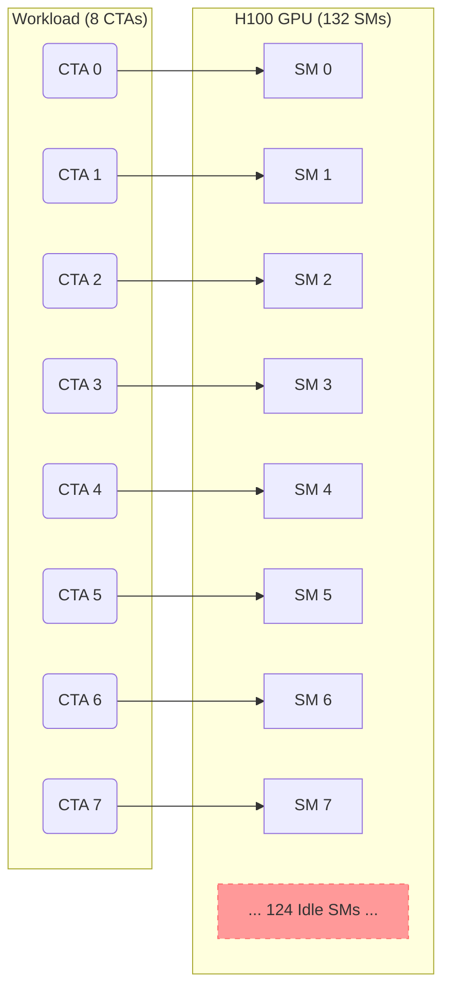

# Technical Details: Upstream Two-Guard Patch

This document explains the mechanism and exact code change for the
`upstream_patch` track. The separate latest-stack tuned `s=3` policy is not the
subject of this document; see [`LATEST_STACK_FINDINGS.md`](LATEST_STACK_FINDINGS.md)
for that appendix track.

**Build scope:** All FA3 builds in this repo are Hopper-only (SM90). Non-Hopper architectures are not compiled.

**Precomputed scheduler metadata:** The headline speedups (~1.19--1.22x) require precomputed scheduler metadata (`get_scheduler_metadata()`). See [`UPSTREAM_PATCH_EXPECTATIONS.md`](UPSTREAM_PATCH_EXPECTATIONS.md) for details.

## 1. The Bottleneck: Hardware Underutilization

On an NVIDIA H100 (Hopper), there are **132 Streaming Multiprocessors (SMs)**. To achieve peak throughput, a kernel must ideally occupy all SMs simultaneously.

### The SM Starvation Problem
In **Multi-Query Attention (MQA)** or **Grouped-Query Attention (GQA)** regimes with short context, the number of parallel work units (tiles) can be as low as 8 ($Batch \times H_{KV}$). Without sequence splitting, the baseline heuristic launches only one Thread Block (CTA) per tile, leaving most of the GPU idle.


> [!IMPORTANT]
> In the diagram above, **~94% of the GPU (124/132 SMs)** remains completely idle during the kernel execution, leading to the "starvation" bottleneck.

---

## 2. The Flaw: The Premature Guard

The root cause of this underutilization was a **premature return guard** in the FlashAttention-3 heuristic logic.

### Original C++ Code (`heuristics.h`)
The original implementation contained the following check early in the `num_splits_heuristic` function:

```cpp
// --- ORIGINAL CODE ---
if (num_n_blocks <= 4) {
    return 1;
}
```

### Why It was Flawed
This guard was originally intended as a "fast path" to avoid the overhead of sequence splitting for short sequences (where $L \le 512$). However, it suffered from two critical architectural oversights:

1.  **Ignored Head Count ($H_{KV}$)**: It only looked at the sequence length (`num_n_blocks`), completely ignoring how many KV heads were active. In Multi-Head Attention (MHA) with 64+ heads, launching 1 CTA per head is enough to fill the GPU. But in MQA ($H_{KV}=1$), it only launches **one CTA per batch item**, which is insufficient.
2.  **Ignored SM Scale**: It did not account for the massive SM count of the H100 (132 SMs). A shortcut that was "safe" on older, smaller GPUs became a major bottleneck on modern Hopper silicon.

By returning `1` split unconditionally, it prevented the sophisticated efficiency optimizer (the "efficiency loop") from ever seeing these low-tile cases.

---

## 3. The Solution: Two-Guard Upstream Patch

The solution is to remove the unconditional short-sequence shortcut only when
the workload is both short and low-tile. This preserves the existing FA3 logic
for shorter and already-saturated cases, while allowing the original
efficiency loop to run for the `nblk=4`, low-tile boundary regime.

### The Code Change (High-Level)

The patch replaces one premature guard with two narrower guards.

#### C++ Logic (Proposed Change)
```cpp
// In Hopper heuristics.h
// OLD: Prematurely return 1 split if sequence is short
// if (num_n_blocks <= 4) return 1;

// NEW: Only return 1 split if nblk is very short OR we already have enough tiles
if (num_n_blocks <= 3) return 1; 
if (num_n_blocks <= 4 && total_mblocks >= 4) return 1;

// Otherwise, fall through to the existing efficiency optimizer...
```

#### Python Reference Implementation
```python
def upstream_two_guard_num_splits(nblk, tiles, num_sms):
    # Guard 1: Extremely short context (L <= 384)
    if nblk <= 3:
        return 1

    # Guard 2: High-tile scenario (B*H_KV >= 4)
    # Splitting overhead at nblk=4 isn't worth it if SMs are full
    if nblk <= 4 and tiles >= 4:
        return 1

    # Win regime: let the existing FA3 efficiency loop choose splits
    return efficiency_loop(nblk, tiles, num_sms)
```

---

## 4. Why It Works

By bypassing the `nblk <= 4` shortcut only in the low-tile boundary regime,
the kernel can recover additional SM parallelism without changing shorter or
already-saturated cases. For `H_KV=1`, moving away from `s=1` increases the CTA
count from **8** to **32** in the `nblk=4` case, materially improving SM
coverage and yielding the reported kernel-level win.

## 5. Performance Impact

| Config | Regime | Baseline Splitting | Candidate Splitting | Speedup |
| :--- | :--- | :--- | :--- | :--- |
| MQA ($H_{KV}=1$), $L=512$ | **Starvation** | 1 | loop-enabled | reviewer benchmark |
| GQA ($H_{KV}=2$), $L=512$ | **Starvation** | 1 | loop-enabled | reviewer benchmark |
| MHA ($H_{KV}=64$), $L=512$ | **Saturated** | 1 | 1 | **1.00x (Safe)** |

---

## 6. Reproduction Methodology: Why a Python Reference Still Exists?

A common question is why the package includes a Python implementation (`src/heuristics_reference.py`) if the final goal is a C++ patch.

The Python reference still serves three useful roles in this repository:

1.  **Policy Introspection**: It lets experiments record which split count each policy would choose at a given shape.
2.  **Rapid Ablations**: It supports ablation and sensitivity studies without recompiling C++ for every alternative threshold.
3.  **Cross-Checking**: It provides a readable mirror of the intended C++ decision logic.

The benchmark uses policy injection with precomputed scheduler metadata for both
tracks, so the full improvement (~1.20–1.24× for `upstream_patch`) is visible.
See [`METHODOLOGY.md`](METHODOLOGY.md).

---

## 7. Heuristic vs. Kernel: Why We Still Compile

*   **The Heuristic (Python)**: The *decision maker*. It takes the attention shape (B, H, L) and outputs `num_splits`. It does **not** perform GPU computation.
*   **The Kernel (C++)**: The *execution engine*. The CUDA/TMA code that performs the actual attention computation.

We compile the FA3 kernels because performance measurements require the real
engine. The benchmark injects split decisions from Python and uses precomputed
scheduler metadata to measure the improvement.
